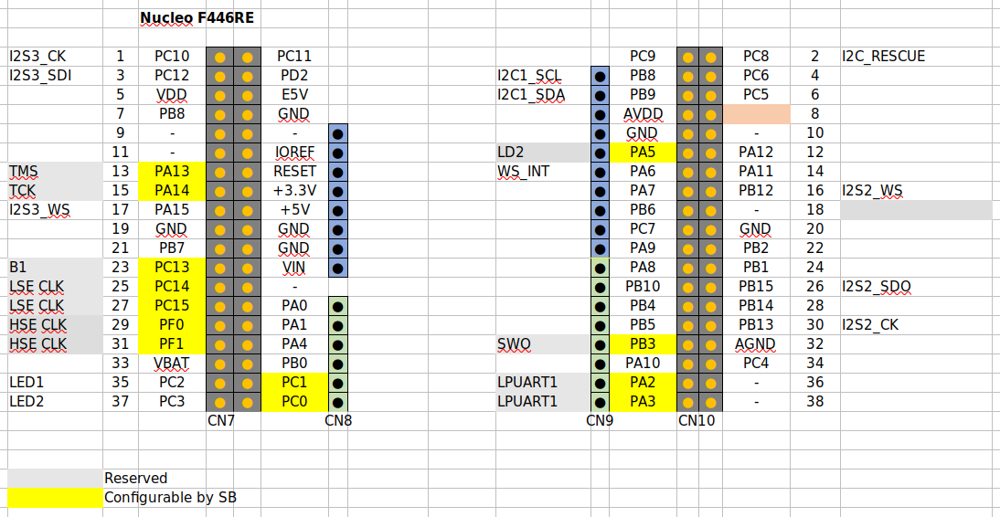

# Akashi-16
Interface board to the TLV320AIC3204 EVB

# Overview
Interface schematics for the 
[EVM](https://www.ti.com/tool/TLV320AIC3204EVM-K#overview) of the 
[TLV320AIC3204](https://www.ti.com/product/TLV320AIC3204) codec. 
the interface board is based on the 
[Akashi-15](https://github.com/suikan4github/Akashi-15). 

# Design 
The EVK will be connected with this board by : 
- 20pin ribbon cable * 2 
- 10pin ribbon cable * 1

The +5V ( D&A ) and +3.3V are given from this board. The internal regulators of the TLV32AIC3204 must be enabled. 

I2C signals and 12MHz MCLCK are given from this board. The EVK is assumed to configured as I2S master. So, the BCLK and WSCLK are given from EVK. 

Nucleo F446RE connection is here : 

# Schematic

There is [PDF version](doc/Akashi-16.pdf). 

# License

This project is shared under the [MIT License](LICENSE). 
